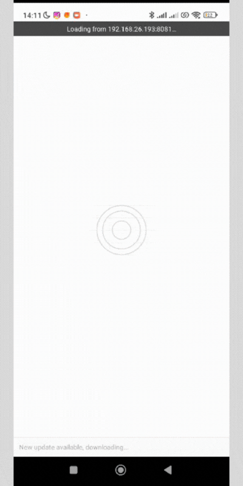

<p align="center">
   
</p>

<p align="right">
   
</p>

<h1 align="center"></h1>

<p align="center">
  

  

  

   

   

    
</p>

<p align="center">
  <a href="#dart-about">About</a> &#xa0; | &#xa0; 
  <a href="#sparkles-features">Features</a> &#xa0; | &#xa0;
  <a href="#rocket-technologies">Technologies</a> &#xa0; | &#xa0;
  <a href="#white_check_mark-requirements">Requirements</a> &#xa0; | &#xa0;
  <a href="#checkered_flag-starting">Starting</a> &#xa0; | &#xa0;
  <a href="#memo-license">License</a> &#xa0; | &#xa0;
  <a href="https://github.com/agostinhomarcia" target="_blank">Author</a>&#xa0; | &#xa0
  <a href="#" target="_blank" rel="noopener noreferrer">Projeto</a>
</p>

<br>

## :dart: About

<h4 align="center">Lista de Filmes </h4>

<p align="center">
  
  
</p>

<p align="left">

### Álcool ou Gasolina? - Calculadora de Abastecimento em React Native

Este projeto é uma aplicação simples em React Native que ajuda os usuários a decidirem se é mais vantajoso abastecer com álcool ou gasolina, com base nos preços informados. A calculadora compara o valor do litro do álcool com o da gasolina e fornece uma recomendação com base na relação entre esses preços.

##### Recursos Principais:

Interface intuitiva para inserção de preços de álcool e gasolina.
Cálculo automático da relação entre os preços.
Recomendação de abastecimento com base no cálculo.
Modal informativo indicando a recomendação.

##### Instruções de Uso:

Insira o preço do litro do álcool no campo correspondente.
Insira o preço do litro da gasolina no campo correspondente.
Clique em "Calcular Recomendação".
Visualize a recomendação na tela principal.
Em caso de recomendação para abastecer com álcool, o modal informativo será exibido, permitindo a inserção de novos valores e recálculo.

###### Tecnologias Utilizadas:

React Native
React Navigation
React Native Modal
StyleSheet (Estilização)
Componentes Nativos do React Native (Image, TextInput, Button, Modal, StatusBar, etc.)

##### Como Executar o Projeto:

Clone este repositório.
Instale as dependências usando `npm install` ou `yarn install` .
Execute o aplicativo em um emulador ou dispositivo usando npm run android ou npm run ios (ou equivalentes do Yarn).

</p>

## :sparkles: Features

:heavy_check_mark: Feature 1;\
:heavy_check_mark: Feature 2;\
:heavy_check_mark: Feature 3;

## :rocket: Technologies

The following tools were used in this project:

- [React Native](https://reactnative.dev/docs/getting-started)
- [React.js](https://legacy.reactjs.org/)
- [StyleSheet](https://reactnative.dev/docs/stylesheet)

## :white_check_mark: Requirements

Before starting :checkered_flag:, you need to have [Git](https://git-scm.com) and [Node](https://nodejs.org/en/) installed.

## :checkered_flag: Starting

```bash
# Clone this project
$ git clone https://github.com/agostinhomarcia/app-movies.git
# Access
$ cd app-movies
# Install dependencies
$ yarn ou npm install
# Run the project
$ npx expo start
# The server will initialize in the <exp://192.168.15.2:8081>
```

## :memo: License

This project is under the [MIT license](./License).

Made with love by [Márcia Agostinho](https://github.com/agostinhomarcia) 🚀.

<p align="center">
   
</p>

&#xa0;

<a href="#top">Back to top </a>
